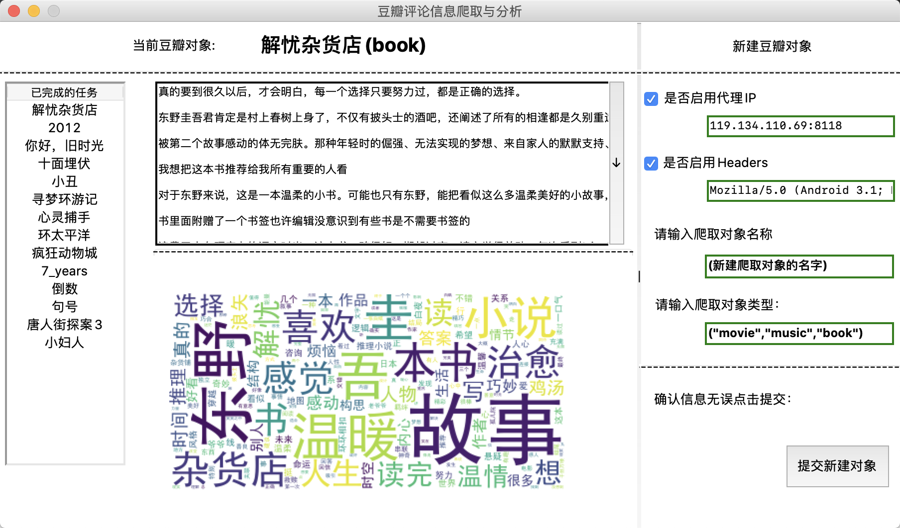

## DouBanAnalyzeSystem
也可以叫做豆瓣短评分析系统。

### V1.0版本

- 头：是当前展示内容的对象
- 左侧：列表从数据库中获取已经爬取并分析完成的对象。
- 右侧上：短评的相信内容，可下拉。
- 右侧下：解析的词云信息。

### V2.2 版本

- 功能已全部完成。比较v1.0增加功能，新建爬虫，可选择启用代理ip池和随机UA选项。
- 提交新建对象以后，后台自动完成爬取和分析，并实施更新到前台UI

